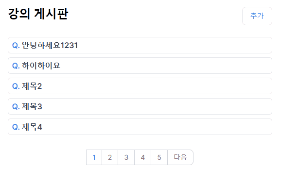
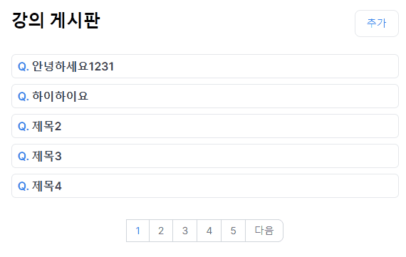
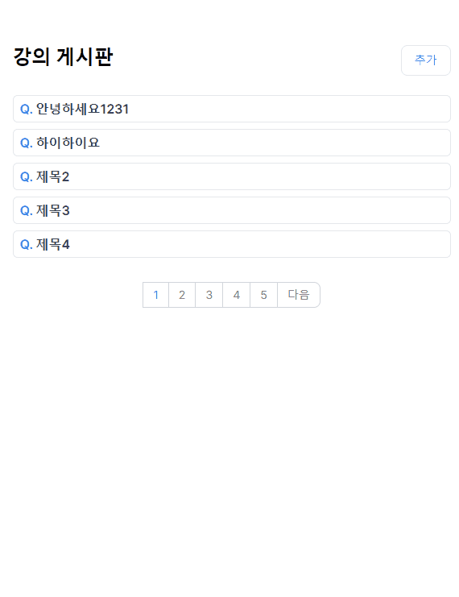
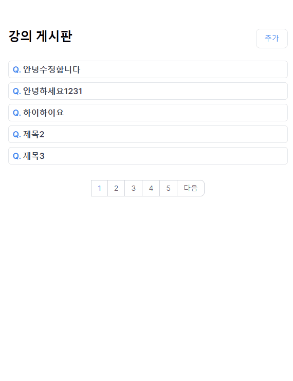

## 📚 사용한 라이브러리 및 프레임워크

- Next.js 14 (app)

  - 첫 페이지(게시물 리스트)와 상세 페이지 `SSR` 적용
  - 게시판 특성상 `SEO`와 빠른 페이지 제공이 필요하다고 판단
  - 각 페이지별 metadata 설정
  - 상세 페이지는 `generateMetadata`를 활용하여 동적으로 metadata를 설정

- Typescript

  - 자동 완성, 타입 추론 등으로 개발 시간을 단축
  - 타입을 정의함으로써, 코드 자체가 문서화 역할

- TailwindCSS

  - 유틸리티 클래스 기반으로 빠른 프로토타이핑이 필요했기 때문에 선택

- React-Query

  - 각 API마다 캐싱 적용하기 위함
  - `useQuery`, `useMutation`, `prefetchQuery` 활용

- Express
  - Mock 서버를 구현하기 위한 NodeJS 서버 세팅
- MSW

  - API를 Mocking 위해 선택
  - 기능 관련하여 Mock API 작성

- React-Quill

  - 게시글 작성 시 일반 텍스트가 아닌 텍스트 에디터를 사용할 수 있기 위한 선택

- isomorphic-dompurify

  - 게시글 내용은 API를 통해 받아온 html 태그 형태 텍스트를 주입하여 보여주기 때문에 XSS 보안을 위해 해당 라이브러리 사용

- html-react-parser
  - 게시글 작성시 a tag를 Link로 변환하기 위해 사용
  - a tag로 링크 이동 시 페이지 전체가 다시 로드되는 상황 방지

## ✏️ Commit 및 Git Branch 컨벤션

### Commit

```
- feat: 새로운 기능 추가
- chore: 코드의 변경이 없는 경우 (패키지 설치 및 설정)
- refactor: 코드 개선
- fix: 버그 수정
- doc: 문서 업데이트
```

### Git Branch

- 추가 기능 구현 시 feature/(큰 단위 기능) 생성

- 리팩토링 진행: refactor

- 각 작업이 완료된 branch ➡️ dev branch

- 최종적으로 dev ➡️ main branch

## 📖 프로젝트 실행 방법

```bash
# 1. 패키지 설치
npm install

---------
## 개발환경 실행

# 1. 서버 실행
npm run mock

# 2.클라이언트 실행
npm run dev

----------
## 배포환경 실행

# 1. 빌드
npm run build

# 2. 서버 실행
npm rum mock

# 3. 클라이언트 실행
npm run start
```

## 🔍 기능 구현 목록

- 첫 페이지 게시물 제목 **목록 표시** 구현 (SSR)
- 게시물 5개 이상일 때 **페이지네이션** 구현
- 게시물 상세 페이지 (제목 및 텍스트) (SSR)
- 게시물 본문에 **다른 게시물의 제목 존재 시 링크 자동 첨부** 구현
- 게시물 생성, 수정 구현

## 🔍 동작 화면

### 1. 첫 페이지



- `searchParams`를 활용해 페이지네이션 구현
- 페이지네이션 관련 코드는 `usePageNation` 커스텀 훅으로 생성
- 페이지 첫 로드시 `prefetchQuery` 사용하여 데이터 사전 fetch 하여 SSR과 빠른 페이지 표시

### 2. 게시물 상세 페이지



- 페이지 첫 로드시 `prefetchQuery` 사용하여 데이터 사전 fetch 하여 SSR과 빠른 페이지 표시
- `generateMetadata`를 활용해 동적으로 metadata 설정
- 게시글 조회 시 '게시글 전체 제목' API를 호출하여 현재 내용에 포함되는 제목이 있는지 판별
- html tag 형태로 content를 받기 때문에 리액트 요소 형태로 변환 하여 표시
  - html-react-parser 라이브러리 XSS 관련 서치 [참고 링크](https://github.com/remarkablemark/html-react-parser/issues/94)
  - html-react-parser 라이브러리 타입 관련 서치 [참고 링크](https://gist.github.com/natterstefan/3bc712eca6ff88781d687b7240a78cc1)

### 3. 게시물 생성



- `React-Quill` 라이브러리를 활용하여 텍스트 에디터 구현
  - `React-Quill` 관련 라이브러리 Next.js 사용시 `dom is not found` 에러 해결 [참고 링크](https://github.com/zenoamaro/react-quill/issues/910)
- `useCreatePostMutation`을 활용해 게시물 생성시 react-query `posts` 태그 invalidate하여 최신 게시글 보장
- `WikiForm` 컴포넌트 생성 후 생성 및 수정에 대해서 재사용이 가능하도록 구현

### 4. 게시물 수정


- params id를 활용해 edit 페이지로 이동 ➡️ 게시물 상세 조회 API(`useGetPostDetailQuery`) 호출
- `useUpdatePostMutation`을 활용해 게시물 수정시 react-query `posts` 및 `[post, detail, id]` 태그 invalidate하여 최신 게시글 보장
- `WikiForm` 컴포넌트에 해당 게시물 정보를 넘김

### 5. 제목 자동 링크



- `useGetTitlesQuery`를 통해 전체 게시물 제목을 불러오고, 게시물 내용에 일치하는 제목을 탐색
- 존재하면 `<a href="${title.id}">${title.title}</a>` 형태로 변환
- `html-react-parser`를 활용하여 `a tag`를 `Link` 요소로 변환하여 주입
- `Link`로 변환하여 주입함으로써 CSR 이점 유지
